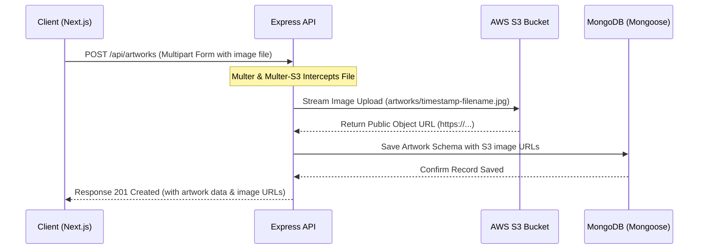

# 🎨 Luminary Art Gallery

A professional, production-ready full-stack Online Art Gallery Management System built as a feature-rich, high-performance platform for artists and art collectors.

Luminary Art Gallery serves as a digital bridge between creative artists looking to showcase and monetize their masterpieces, and art collectors seeking unique digital and physical artworks.

---

## 🚀 Overview of the Project

Luminary Art Gallery features a robust architecture combining a Next.js frontend with an Express/Node.js backend, powered by MongoDB for relational-like document persistence and AWS S3 for secure, highly scalable image hosting.

### Key Capabilities:
*   **🖼️ Dynamic Interactive Gallery:** Advanced multi-dimensional filtering by category, artist, price range, and search terms.
*   **👨‍🎨 Artist Portfolios & Verification:** Dedicated dashboards for artists to display portfolios, upload new works, track status, and request seller verification.
*   **🛒 Persistent Shopping Cart & Wishlist:** Fully client-side persisted state powered by Zustand.
*   **💳 Checkout & Payment Gateway:** Integrated secure credit card checkouts and order processing.
*   **📊 Admin Dashboard:** Rich analytical graphs, revenue stats, user verification controllers, artwork CRUD operations, and order dispatch management.
*   **⭐ Ratings & Reviews:** Dedicated feedback loops for collectors to rate artworks they have purchased.

---

## ⚡ How We Built This Project: The "Vibe Coding" Paradigm

This project is a testament to the modern **"Vibe Coding"** software development model—a highly collaborative, fast-paced, and fluid iteration cycle between the developer (human product engineer) and the AI (Antigravity/Gemini). 

### What is Vibe Coding?
Rather than writing boilerplate lines of code or dealing with standard compilation setup loops, Vibe Coding shifts focus to **high-level intent, rapid design, and prompt-driven architecture**. 

### Our Vibe Coding Workflow:
1.  **Intent-Driven Iteration:** We set high-level goals (e.g., *"migrate from Cloudinary to AWS S3"* or *"add a custom review component"*), and let the AI propose files, configurations, and structural changes.
2.  **Live Debugging & Refactoring:** When errors arose—such as Mongoose callback deprecations or API integration mismatches—we solved them through real-time log analysis and prompt-based troubleshooting.
3.  **No Placeholders:** From day one, we committed to building actual, usable endpoints and UI components, avoiding mock files in favor of authentic database schemas, AWS integrations, and React states.
4.  **Flow-State Development:** By automating repetitive boilerplate, the developer maintained a high-velocity product flow, focusing on UX aesthetics and architecture while delegating execution and debugging to the AI.

---

## ☁️ AWS S3 Integration & Architecture

To support high-definition images uploaded by artists without degrading performance, we migrated our media storage from Cloudinary to **AWS Simple Storage Service (S3)**.

### Architecture Data Flow:


### AWS S3 Implementation Details:

1.  **Multer-S3 Integration:** The backend uses `multer-s3` coupled with the `aws-sdk` client to stream incoming uploads directly to the S3 bucket without writing temporary files to the disk.
2.  **Permissions & CORS Configuration:**
    *   To allow the Next.js frontend and Express backend to fetch and put resources directly, we configured the S3 bucket's CORS as follows:
        ```json
        [
          {
            "AllowedHeaders": ["*"],
            "AllowedMethods": ["GET", "PUT", "POST", "DELETE"],
            "AllowedOrigins": ["http://localhost:3000", "http://localhost:5000"],
            "ExposeHeaders": ["ETag"],
            "MaxAgeSeconds": 3000
          }
        ]
        ```
    *   **Public Access:** Enabled public access to the bucket objects with `ACL: 'public-read'` set during the upload parameters, ensuring that image URLs stored in the MongoDB database are immediately viewable by clients.
3.  **IAM Policy Security:** An IAM User (`artgallery-backend`) was configured on AWS with programmatic access keys, restricted to S3 operations:
    ```json
    {
      "Version": "2012-10-17",
      "Statement": [
        {
          "Effect": "Allow",
          "Action": [
            "s3:GetObject",
            "s3:PutObject",
            "s3:DeleteObject"
          ],
          "Resource": "arn:aws:s3:::artgallery-uploads-2025/*"
        }
      ]
    }
    ```

---

## 🛠️ Technology Stack

| Layer | Technology | Description |
| :--- | :--- | :--- |
| **Frontend Framework** | `Next.js 14` (App Router) | High-performance React framework supporting SSR/ISR and clean routing. |
| **State Management** | `Zustand` | Lightweight, fast client-side state for shopping carts and user auth states. |
| **Styling & Animation**| `Tailwind CSS` & `Framer Motion` | Modern responsive styling with premium, fluid interactive transitions. |
| **Backend API** | `Node.js` & `Express.js` | Modular REST API with async controllers and custom route validation. |
| **Database** | `MongoDB` & `Mongoose ODM` | NoSQL document database mapping artwork, users, orders, and reviews. |
| **Storage CDN** | `AWS S3` | Distributed, highly available object storage for all high-res art media. |
| **Authentication** | `JSON Web Tokens (JWT)` & `BcryptJS` | Secure stateless auth with password encryption. |

---

## 🏃‍♂️ Getting Started

### 1. Prerequisites
*   Node.js (v18.x or higher)
*   MongoDB Instance (Local Community Edition or Atlas cluster URI)
*   AWS S3 Bucket with programmatically generated Access Key & Secret

### 2. Environment Setup

Create a `.env` file in the `backend` directory:
```env
PORT=5000
MONGO_URI=your_mongodb_connection_string
JWT_SECRET=your_jwt_secret_key_here
JWT_EXPIRE=30d
NODE_ENV=development

# AWS S3 Configurations
AWS_ACCESS_KEY_ID=your_aws_access_key_id
AWS_SECRET_ACCESS_KEY=your_aws_secret_access_key
AWS_REGION=us-east-1
AWS_S3_BUCKET_NAME=artgallery-uploads-2025
```

Create a `.env.local` file in the `frontend` directory:
```env
NEXT_PUBLIC_API_URL=http://localhost:5000/api
```

### 3. Installation
You can install dependencies for the root, backend, and frontend concurrently using the workspace script:
```bash
npm run install-all
```

### 4. Database Seeding
To populate categories, mock art exhibitions, default admins, and test artwork:
```bash
npm run seed
```

### 5. Running the Application
Launch both backend and frontend servers concurrently:
```bash
npm run dev
```
*   **Frontend client:** http://localhost:3000
*   **Backend API server:** http://localhost:5000

---

## 📁 Key File Structure

```
artgallery/
├── backend/
│   ├── config/          # DB connection, AWS S3 upload configs, seeding scripts
│   ├── controllers/     # Controller layer (auth, artworks, orders, reviews)
│   ├── middleware/      # Auth shields, role check middleware, error handers
│   ├── models/          # Mongoose document models
│   ├── routes/          # REST route declarations
│   └── server.js        # Main Express engine entry point
└── frontend/
    ├── app/             # Next.js App Router (gallery, artists, auth, admin, cart)
    ├── components/      # Shared components (NavBar, ProductCard, AdminPanel)
    └── lib/             # API clients, helpers, and Zustand global stores
```

---

## 🔒 Security Best Practices Implementations
*   **Secret Management:** No credentials or access keys are ever hardcoded in the codebase. All runtime constants are driven by S3 IAM-restricted environments.
*   **Role-Based Access Control (RBAC):** Middleware checks verify whether requests originate from verified Buyers, Sellers (Artists), or Administrators.
*   **Password Hashing:** Implemented one-way salt hashing using `bcryptjs` before committing user profiles to MongoDB.
